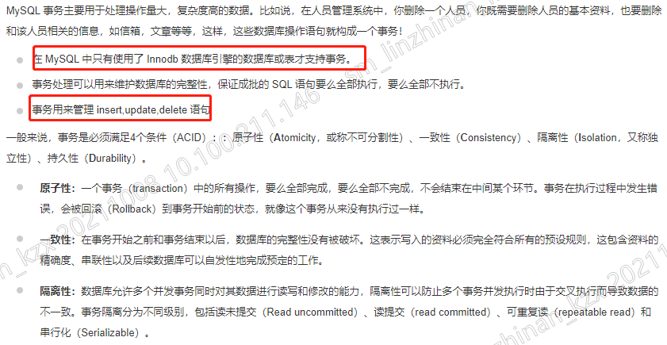

# 第11章、事务

```
1认识事务
2事务控制语句
3事务的实现方式
4purge thread回收undo线程
5事务统计QPS与TPS
6事务隔离级别
7事务group commit
8事务两阶段提交


```

​	

## 1认识事务

概括：事务是由一条sql语句或者多条sql语句组成执行单元，这个执行单元是不可分割的，sql语句要么全部执行成功要么全部不执行；


事务特性：ACID

​	原子性：同一事务中，sql语句要么全部执行成功要么全部不执行

​	一致性：在事务开始之前和事务结束以后，数据的约束是不会被破坏；

​	隔离性：并发事务之间的数据是相互隔离的

​	持久性：事务提交后，所有操作的结果都会被保存到磁盘，持久化存储


## 2事务控制语句

开启事务：

start transaction [read only]；

read only：开启一个只读事务

​	。只允许进行读操作，不允许写操作

​	。只读事务性能较高，因为只读事务不用写redo、undo

​	。读操作事务id的值非常大


start transaction [read write]；开启了一个读写事务

start transaction；5.7+

begin;

begin work;


事务提交：

​	显示事务提交：commit

​	隐式事务提交：

​		。重新开启一个事务

​		。autocommit=1自动提交事务

​			set autocommit=1 只能开启session级别的事务自动提交；生产中建议开启事务自动提交

事务回滚：

​	显示事务回滚：rollback;

​	隐式事务回滚：

​		。连接断开

​		。线程被kill

​			show processlist;查看当前实例开启的线程；

​		。异常宕机


## 3事务的实现方式

原子性：回滚日志 undo id=1, id=2

trx：

begin;

update .. 成功 写入数据库 id=2

insert .. 失败 不会操作数据库

rollback;


一致性：回滚日志 undo


隔离性：锁

begin;

​	update .. where id=1;

commit;


持久性：重做日志 redo


undo

redo

binlog


## 4purge thread线程

用于回收undo log；

insert undo：一个事务中有insert插入操作，只需提交事务，purge线程就立即回收insert undo

update undo：只有等到所有使用旧版本信息的事务提交或回滚，才可以回收update undo


purge线程真正删除或者修改数据；delete和update只是做了标记；


## 5事务统计QPS与TPS

QPS：每秒的请求数（DML,DDL,DCL,SELECT）

​	方法1：status; QPS平均值

​	方法2：\s; QPS平均值

​	方法3：mysqladmin -uroot -p123456 -S /data/mysql/mysql3306/mysql.sock ext -i 1 -r |grep -i questions 获取实时的请求数

​	方法4：QPS平均值

​				show global status like '%Questions%';

​				show global status like '%Uptime%';

TPS：每秒的事务数

​	方法：取平均值

​	show global status like '%Com_commit%'; 统计提交次数

​	show global status like '%Com_rollback%'; 统计回滚次数

​	show global status like '%Uptime%';

​	(Com_commit+Com_rollback)/Uptime


## 6事务隔离级别

①事务有哪些隔离级别

​	读未提交（read-uncommitted）RU

​	读已提交（read-committed）RC

​	可重复读（repeatable-read）RR

​	可串行化（serializeable）

②查看隔离级别

select @@tx_isolation;

select @@transaction_isolation;

select processlist_id,VARIABLE_VALUE from variables_by_thread,threads where variables_by_thread.thread_id=threads.thread_id and VARIABLE_NAME='tx_isolation';

③设置隔离级别

set session transaction isolation level repeatable read;

set global transaction isolation level read committed;

配置文件：transaction_isolation=repeatable-read

④不同隔离级别下会产生什么隔离效果

​	脏读：一个事务可以读取另一个并行的事务的脏页（未提交的update,delete,insert）

​	不可重复读：一个事务可以读取另一个并行的事务的已提交的修改操作update

​	幻读：一个事务可以读取另一个并行的事务的已提交的插入操作insert

​	读未提交（read-uncommitted）RU

​		产生脏读

​	读已提交（read-committed）RC

​		不会产生脏读，产生不可重复读；

​	可重复读（repeatable-read）RR

​		不会产生脏读，不会产生不可重复读；会产生幻读；

​	可串行化（serializeable）读加锁，写加锁，读写冲突

​		不会产生脏读，不会产生不可重复读；不会产生幻读；


## 7事务组提交group commit

开发：

​	begin;

​		insert 

​		update ..

​	commit;

组提交：一次性刷写多个事务

​	show variables like '%group_commit%';

	| binlog_group_commit_sync_delay          | 0    
	| binlog_group_commit_sync_no_delay_count | 0    


## 8事务两阶段提交

阶段1：写redo log，事务处于prepare

阶段2：写binlog，事务处于commit

​			写binlog成功有xid事件，会将xid写入redo log


redo log 与 binlog区别：

①redo log是innodb存储引擎独有的，binlog是不区分存储引擎

②记录内容不同，redo log是物理逻辑日志，记录页的变化过程；binlog是逻辑日志，记录事务具体操作的内容

③写入时间不同，先写入redo log，再写入binlog

④redo log是循环使用文件，binlog每次新增一个文件


​			

1⃣️SELECT语句 也会发生事务，select 现在也被划分到DML语句中

MDL事务

大事务会有什么影响？

 1.主从复制延迟

 2.阻塞、锁等待，还说到了回滚等待时间比较长

 这里还问到了 select 不提交，算大事务吗？会造成锁吗？

select查询，如果不显式开启事务，根本就不算事务



 1.select 事务⻓时间不提交，那么即构成 长时间未提交的事物 那么就是⼤事务

 2.会造成锁吗？我这边自己理解：因为 select 是读操作，那会加⼀个读锁，那我其他事物进行 update 当然会造成锁等待，但是innodb 存引擎会有快照 ，所以不会加锁


